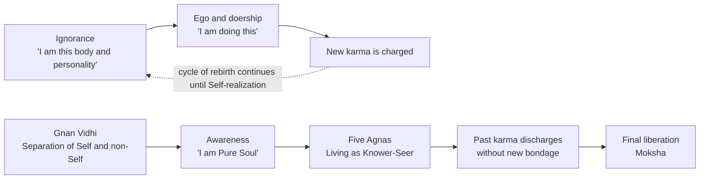
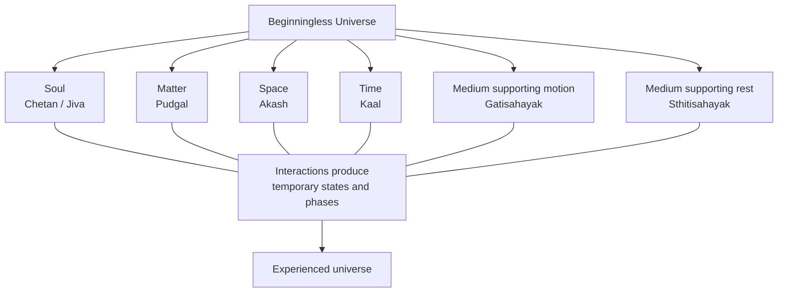
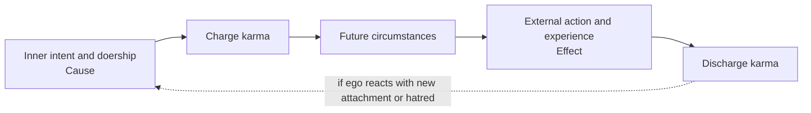
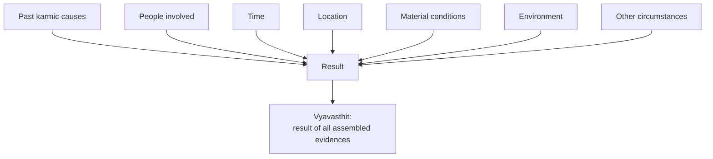
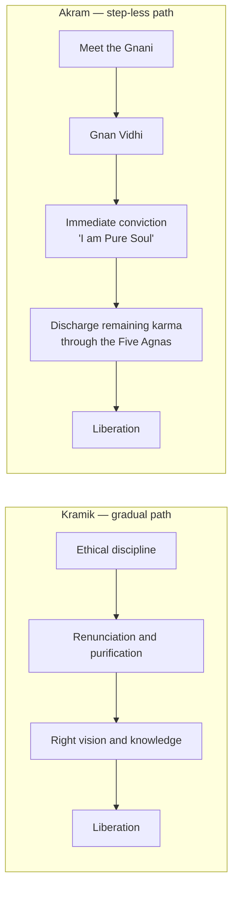
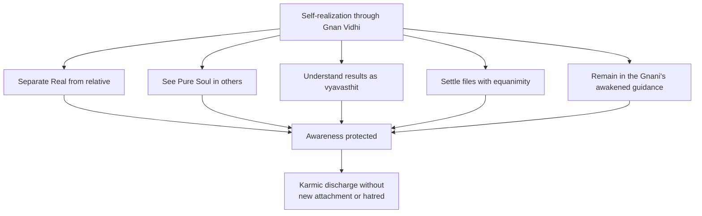
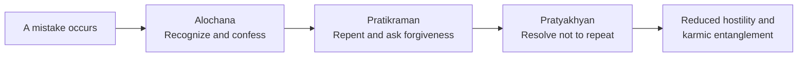
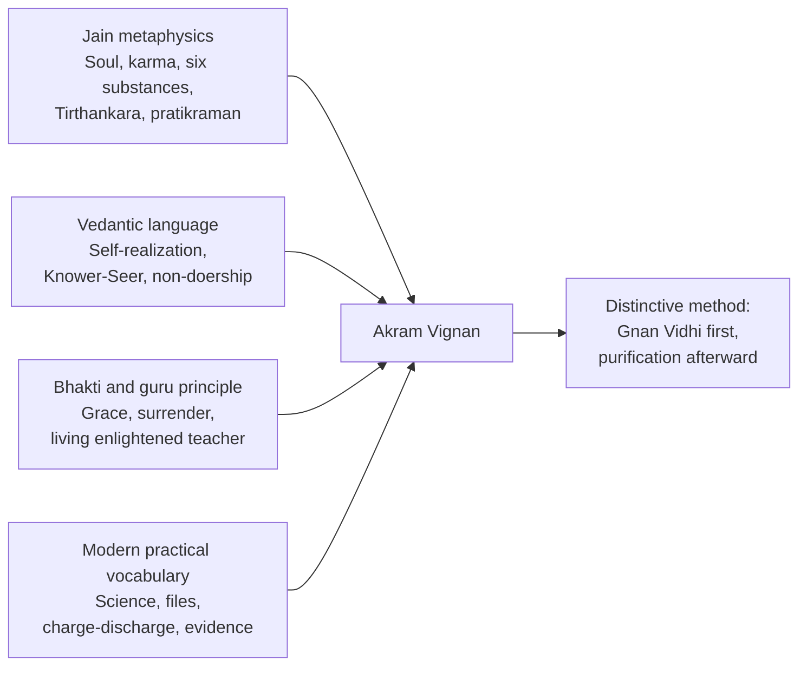

# Dada Bhagwan Philosophy

## Akram Vignan, its Jain foundations, Vedantic parallels, and distinctive teachings

## Introduction

**Dada Bhagwan philosophy**, usually called **Akram Vignan**, is a modern spiritual movement that emerged in Gujarat through the teachings of **Ambalal Muljibhai Patel**, commonly addressed as **Dadashri**.

According to the movement’s account, Ambalal Patel experienced spontaneous Self-realization at Surat railway station in 1958. He subsequently taught a direct or “step-less” method of attaining awareness of the true Self while continuing ordinary household life. Akram Vignan presents itself as a practical spiritual science rather than a new religion and says that followers do not need to abandon their existing religion, family, occupation, or religious teacher. ([dadabhagwan.org][1])

A crucial naming distinction is often missed:

| Term                        | Meaning within Akram Vignan                                              |
| --------------------------- | ------------------------------------------------------------------------ |
| **Ambalal Muljibhai Patel** | The historical person and householder                                    |
| **Dadashri**                | Ambalal Patel functioning as the *Gnani Purush*, or enlightened teacher  |
| **Dada Bhagwan**            | The fully manifested divine Self said to have become revealed within him |
| **Akram Vignan**            | The “step-less science” of Self-realization that he taught               |

Therefore, strictly speaking, the movement does not simply claim that the physical person Ambalal Patel was God. Its own explanation distinguishes the human instrument from the fully awakened Pure Self called “Dada Bhagwan.” ([Dada Bhagwan][2])

---

# Part I — The High-Level Philosophy

At its simplest, Akram Vignan teaches:

> You are not fundamentally your name, body, mind, emotions, social position, or personal history. Your real identity is the eternal **Pure Soul**, whose nature is knowledge, vision, bliss, and spiritual power.

Bondage occurs because a person believes:

> “I am this body and personality, and I am the doer of these actions.”

Liberation begins when this mistaken identification is broken and the individual directly experiences:

> “I am Pure Soul, separate from the mind, speech, body, and ego.”

The person then continues to perform family, professional, and social responsibilities, but attempts to remain inwardly established as the **Knower and Seer** rather than as the egoistic doer. ([dadabhagwan.org][3])

---

# Part II — The Metaphysical Foundation

## 1. The Six Eternal Elements

Akram Vignan teaches that the universe was not created by a personal God. It has no first beginning and consists of six eternal elements:

1. **Chetan or Atma** — conscious Soul
2. **Pudgal** — inanimate matter
3. **Akash** — space
4. **Kaal** — time
5. **Gatisahayak tattva** — the principle supporting motion
6. **Sthitisahayak tattva** — the principle supporting rest or inertia

None of these elements was created, and none can be destroyed. The visible world arises from their changing relationships and temporary phases rather than from an act of divine creation. ([dadabhagwan.org][4])

### Where does this concept come from?

This is almost directly the **classical Jain doctrine of six substances**, or *dravya*:

| Akram Vignan   | Classical Jainism               |
| -------------- | ------------------------------- |
| Chetan or Soul | Jiva                            |
| Pudgal         | Pudgala, matter                 |
| Gatisahayak    | Dharma-dravya, medium of motion |
| Sthitisahayak  | Adharma-dravya, medium of rest  |
| Akash          | Akasha, space                   |
| Kaal           | Kala, time                      |

Classical Jain philosophy describes these same six fundamental constituents of reality. The similarity is so close that Akram Vignan’s basic cosmology should be classified as **predominantly Jain rather than Vedantic**. ([Stanford Encyclopedia of Philosophy][5])

---

## 2. The Soul

The Soul is described as eternal, formless, conscious, and inherently possessing:

* Infinite knowledge
* Infinite perception or vision
* Infinite energy
* Infinite bliss

Every living being possesses a Soul with the same essential properties, although karmic coverings prevent those qualities from becoming fully manifest. ([dadabhagwan.org][6])

Akram Vignan frequently says:

> “The Pure Soul is God.”

However, this does not mean that all souls merge into one universal being. Each soul remains individually existent. A liberated soul does not dissolve into another God or into a universal consciousness. ([dadabhagwan.org][7])

This is an important difference from **Advaita Vedanta**.

---

## 3. The Real Self and the Relative Self

Akram Vignan analyzes a person from two viewpoints.

### The relative viewpoint

From the relative viewpoint, a person is:

* A named individual
* A physical body
* A mind and personality
* A family member
* A professional or householder
* A participant in social and karmic relationships

Dadashri often used the generic name **“Chandubhai”** to represent this worldly personality. A modern reader substitutes their own name.

### The real viewpoint

From the real viewpoint, the person is:

* Pure Soul
* Permanent consciousness
* Knower and Seer
* Separate from the body-mind complex
* Intrinsically free from anger, pride, attachment, and greed

```mermaid
flowchart TB
    PERSON["A human person"]

    REL["Relative viewpoint<br/>Vyavahar"]
    REAL["Real viewpoint<br/>Nischay"]

    PERSON --> REL
    PERSON --> REAL

    REL --> R1["Name and body"]
    REL --> R2["Mind, speech and behavior"]
    REL --> R3["Family and social roles"]
    REL --> R4["Karmic personality"]

    REAL --> S1["Pure Soul"]
    REAL --> S2["Knower-Seer"]
    REAL --> S3["Permanent consciousness"]
    REAL --> S4["Non-doer"]

    NOTE["Both viewpoints are used:<br/>do not deny worldly responsibilities,<br/>but do not mistake them for the permanent Self."]

    REL --> NOTE
    REAL --> NOTE
```

The goal is not to destroy the relative personality immediately. It is to stop confusing it with the permanent Self.

Akram Vignan therefore encourages a person to treat their own personality as **“file number one”**—something to be observed and cared for, but not mistaken for the real Self. ([Dadabhagwan Download][8])

---

# Part III — Karma and Doership

## 4. Charge Karma and Discharge Karma

Akram Vignan divides karma into two practical stages.

### Charge karma

New karma is charged when a person internally believes:

* “I am doing this.”
* “I caused this result.”
* “I want this to happen.”
* “I hate this person.”
* “I deserve the credit.”
* “I will take revenge.”

The deepest cause of bondage is therefore not merely physical action but **egoistic doership and inner intention**.

### Discharge karma

The present body, personality, thoughts, speech, circumstances, and visible actions are understood primarily as the discharge or effect of causes created previously.

The normal cycle is:

1. Old karma produces a present event.
2. The ego reacts with attachment, hatred, pride, blame, or doership.
3. That reaction charges new karma.
4. New karma produces a future experience.

Self-realization is said to break the cycle at the second step. The event still occurs, but the awakened person tries to remain the Knower-Seer and avoid creating a new egoistic cause. ([dadabhagwan.org][9])

### Jain source of the concept

The foundation is clearly Jain:

* Jainism teaches that karma binds the soul.
* **Asrava** is karmic influx.
* **Bandha** is bondage.
* **Samvara** stops new influx.
* **Nirjara** removes existing karma.
* **Moksha** occurs when karmic bondage is completely ended. ([Jain World][10])

Akram Vignan’s “charge/discharge” language is a modern practical restatement of this structure.

Its distinctive contribution is the strong emphasis that:

> Visible conduct is principally discharge, while the belief in doership is what charges fresh karma.

That exact terminology and its systematic use are characteristic of Akram Vignan, even though the underlying karmic framework comes from Jainism.

---

## 5. Vyavasthit — Scientific Circumstantial Evidences

One of Akram Vignan’s best-known teachings is **vyavasthit shakti**, usually translated as:

> “The result of scientific circumstantial evidences.”

It means that an event occurs only when all necessary circumstances come together:

* Past karma
* Other people
* Physical conditions
* Time
* Place
* Material causes
* Social circumstances
* Numerous unseen contributing factors

No single person independently controls the entire result.

Vyavasthit is not supposed to mean:

> “Do nothing because everything is predetermined.”

A person must still make decisions, take precautions, work, apologize, protect others, and fulfill responsibilities. The teaching addresses ownership of the **final result**, not whether practical effort should occur.

The intended attitude is:

> Perform the appropriate action, but do not claim that you alone created the outcome.

Akram Vignan rejects a creator God and teaches that the universe and its events arise through the interaction of eternal elements and circumstances. ([dadabhagwan.org][11])

### Where did this come from?

Vyavasthit has parallels with:

* Jain karma theory
* Jain causal pluralism
* The many-sided analysis associated with Jain viewpoints
* Broader Indian teachings about karma and non-doership

However, the expression **“scientific circumstantial evidences”** and its use as a central daily-life doctrine are distinctive formulations of Akram Vignan.

---

# Part IV — The Akram Method

## 6. Kramik and Akram Paths

The term **kramik** means gradual or step-by-step.

The traditional spiritual path is compared to climbing stairs:

* Ethical discipline
* Scriptural study
* Reduction of passions
* Renunciation
* Meditation
* Ascetic practice
* Progressive purification
* Right knowledge
* Final liberation

The **Akram** path is described as an elevator:

* The Gnani directly gives awareness of the Self.
* The seeker does not first complete every stage of purification.
* Remaining impurities and karma are dealt with after Self-realization.

This is the central innovation claimed by the movement: **Self-realization comes first; gradual purification follows afterward.**

Akram sources say that this direct awakening can occur through a roughly two-hour process and does not require abandoning family life or becoming a monk. ([dadabhagwan.org][3])

---

## 7. Gnan Vidhi

**Gnan Vidhi** is the formal process through which the Gnani is believed to awaken Self-knowledge in a seeker.

The ceremony generally includes:

1. Prayer and devotional surrender
2. Repetition of statements separating the Self from the non-Self
3. Breaking the belief “I am this name and body”
4. Establishing the conviction “I am Pure Soul”
5. Explanation of the Five Agnas

The movement maintains that the Gnani’s grace is necessary because the ego cannot completely remove its own foundational misidentification. ([dadabhagwan.org][3])

### Traditional and distinctive elements

The concept contains several older Indian elements:

* **Atma-jnana**, or knowledge of the Self, is widespread in Indian philosophy.
* **Bheda-jnana**, discerning Self from non-Self, appears in Jain and other traditions.
* The transformative role of a realized guru is prominent in Vedanta and bhakti traditions.
* Grace transmitted through a spiritual teacher is common in devotional Hindu movements.

What is distinctive is the combination:

> A standardized, relatively brief initiation led by an authorized Gnani is said to produce direct Self-realization before complete ethical or ascetic purification.

Scholar Peter Flügel identifies this reliance on salvific knowledge through surrender to the Gnani as one of the important differences between Akram Vignan and traditional Jain gradualism. ([SOAS Repository][12])

---

## 8. The Five Agnas

After Gnan Vidhi, followers are instructed to live according to the **Five Agnas**, or five directives of the Gnani.

Their detailed wording is normally explained during the Gnan Vidhi, but their practical themes include:

* Maintaining awareness of the distinction between the real and relative self
* Seeing the Pure Soul in other living beings
* Understanding events through vyavasthit
* Settling karmic relationships or “files” with equanimity
* Remaining within the Gnani’s guidance and awakened awareness

The Five Agnas are intended to protect the awareness received during Gnan Vidhi and allow old karma to discharge without producing new bondage. ([dadabhagwan.org][13])

---

## 9. “Settle Every File with Equanimity”

Akram Vignan calls every karmic relationship or unresolved circumstance a **file**.

Examples include:

* The person’s own mind and personality: file number one
* Spouse
* Children
* Parents
* Employer
* Colleagues
* Financial obligations
* Conflicts
* Health conditions

To “settle a file with equanimity” means:

* Do what is practically and ethically required
* Avoid attachment and hatred
* Avoid unnecessary conflict
* Accept that the result is not under one person’s exclusive control
* Complete the relationship or obligation without creating new karmic hostility

Equanimity does not necessarily mean passivity, agreement, or remaining in harmful circumstances. It refers to the inner intention not to generate revenge, hatred, or egoistic conflict while taking appropriate action. ([Dadabhagwan Download][14])

The language of **files** is a distinctly modern Akram Vignan teaching. Its philosophical foundation, however, comes from Jain equanimity, nonattachment, karma, and the settling of karmic accounts.

---

# Part V — Pratikraman and Ethics

## 10. Pratikraman

Akram Vignan gives great importance to **pratikraman**, a three-part process:

1. **Alochana** — recognizing and confessing the mistake internally
2. **Pratikraman** — repentance and asking for forgiveness
3. **Pratyakhyan** — resolving not to repeat the mistake

([dadabhagwan.org][15])

### Jain origin

Pratikraman is an established Jain practice and was not invented by Dada Bhagwan.

Traditional Jain pratikraman includes:

* Review of conduct
* Repentance for harm
* Confession
* Renewal of vows
* Restoration of equanimity

### Akram reinterpretation

Akram Vignan makes pratikraman:

* Immediate rather than only periodic
* Applicable throughout daily life
* Focused on individual interpersonal mistakes
* Performed while maintaining that the Pure Soul itself is faultless
* Directed toward cleansing the relative self’s hostile intentions

This is therefore an adaptation and expansion of an existing Jain practice rather than an entirely new doctrine.

---

## 11. Ahimsa and the Faultless Vision

Akram Vignan strongly emphasizes:

* Nonviolence
* Avoiding clashes
* Adjusting in relationships
* Not hurting another person’s ego
* Seeing the Pure Soul behind imperfect conduct
* Accepting responsibility for one’s own reactions
* Performing pratikraman when harm occurs

Its “faultless vision” teaches that the Pure Soul in every person is inherently faultless, while mistakes belong to the karmic personality and unfolding circumstances.

This resembles the Jain distinction between the pure jiva and its karmic coverings. Jain ethics likewise emphasizes nonviolence, nonattachment, and the purification of the soul from karmic matter. ([Stanford Encyclopedia of Philosophy][5])

A practical limitation must be recognized: spiritual explanations about karma and faultlessness should not be used to excuse abuse, criminal conduct, exploitation, or failures of accountability. One may attempt to avoid hatred while still establishing boundaries, reporting wrongdoing, seeking protection, or pursuing justice.

---

# Part VI — Simandhar Swami and Liberation

## 12. Who Is Simandhar Swami?

Akram Vignan gives a central role to **Simandhar Swami**, described as a presently living Tirthankara in **Mahavideh Kshetra**, a realm within Jain cosmology.

Followers believe that devotion and connection to Simandhar Swami help establish the conditions for eventual final liberation. ([dadabhagwan.org][16])

This concept is not originally created by Akram Vignan. Traditional Jain cosmology already teaches that Tirthankaras are presently active in Mahavideha, even though no Tirthankara is currently living in our Bharata region.

### What Akram Vignan changes

Akram Vignan makes Simandhar Swami much more central to ordinary devotional practice:

* He becomes the present living Tirthankara
* The Gnani acts as the practical connection to him
* Devotion to him supports a future birth near him
* Final keval-jnana and liberation are expected through that future connection

Flügel identifies this central salvific role of Simandhar Swami and the Gnani-medium as a distinctive feature of the movement. ([SOAS Repository][12])

These stages are statements of Akram Vignan belief, not empirically verifiable descriptions of another cosmic realm.

---

## 13. Two Stages of Liberation

Akram Vignan often distinguishes between:

### First liberation

Freedom from inner suffering while still living in the body.

The person continues to experience:

* Physical pain
* Social difficulties
* Thoughts and emotions
* Family obligations
* Karmic consequences

But increasingly experiences these as belonging to the relative self rather than to the Pure Soul.

### Final liberation

When all remaining karma is exhausted:

* Rebirth ends
* The soul becomes completely free of karmic coverings
* Infinite knowledge and bliss become fully manifest
* The soul remains eternally liberated

This understanding is substantially Jain. It should not be confused with merging into Brahman or eternally serving a supreme creator God.

---

# Part VII — Comparison with Jainism and Vedanta

## 14. Concept-by-Concept Comparison

| Akram Vignan concept                 | Closest source                                      | What Akram Vignan changes                                        |
| ------------------------------------ | --------------------------------------------------- | ---------------------------------------------------------------- |
| Six eternal elements                 | Classical Jainism                                   | Uses modern Gujarati and “scientific” explanatory language       |
| Eternal individual souls             | Jainism                                             | Calls the realized Pure Soul “God” more freely                   |
| Karma as bondage                     | Jainism                                             | Emphasizes charge versus discharge                               |
| Karma caused by doership             | Jainism and broader Indian philosophy               | Makes doership the central practical diagnostic                  |
| No creator God                       | Jainism                                             | Explains events through scientific circumstantial evidences      |
| Real and relative viewpoints         | Jain *naya* theory; also Indian two-level discourse | Turns it into a daily awareness practice                         |
| Ahimsa                               | Jainism                                             | Applies it strongly to speech, emotional hurt, and relationships |
| Pratikraman                          | Jainism                                             | Makes it an immediate, repeated interpersonal tool               |
| Simandhar Swami                      | Jain cosmology                                      | Makes him central to the present path of liberation              |
| Knower-Seer Self                     | Jainism; parallels in Vedanta                       | Combined with “file number one” and discharge theory             |
| Gnani’s grace                        | Guru and bhakti traditions                          | Grace directly establishes Self-realization through Gnan Vidhi   |
| Self-realization before purification | Distinctive Akram claim                             | Reverses the normal gradual sequence                             |
| Householder liberation path          | Jain lay spirituality, Vedanta and bhakti           | Removes the requirement for prior monastic renunciation          |
| Five Agnas                           | Distinctive Akram framework                         | Post-realization operating model                                 |
| Vyavasthit                           | Jain causality and karma background                 | Distinctive “scientific circumstantial evidences” formulation    |
| “Files” and equanimous settlement    | Jain karmic accounts and equanimity                 | Modern psychological and relational vocabulary                   |

---

## 15. Is Akram Vignan a Form of Jainism?

The answer depends on the level being examined.

### Metaphysically: predominantly Jain

Its strongest foundations are Jain:

* Six eternal substances
* Plural individual souls
* No creator God
* Real karmic bondage
* Keval-jnana
* Tirthankaras
* Simandhar Swami
* Mahavideha
* Pratikraman
* Ahimsa
* Liberation through the complete removal of karma

### Institutionally: independent

Akram Vignan does not present itself as a Jain sect requiring conversion. It has its own:

* Gnani lineage
* Gnan Vidhi
* Five Agnas
* Temples and devotional practices
* Vocabulary
* Publications
* Community structure

### Devotionally: Jain plus bhakti and guru elements

Its emphasis on surrender to the living Gnani, grace, devotional worship, and a personal connection to Simandhar Swami gives it a stronger bhakti orientation than many classical philosophical presentations of Jainism.

For this reason, scholarly analysis has described the movement as a form of **Jain–Vaishnava or Jain–bhakti syncretism** rather than as purely traditional Jainism. ([SOAS Repository][12])

---

## 16. Is It Advaita Vedanta?

It shares some language with Advaita:

* “I am not the body”
* The Self is eternal consciousness
* The Self is the Knower-Seer
* Ignorance causes bondage
* Self-knowledge brings liberation
* The Self is inherently free
* The realized person can live in the world without inner attachment

However, the underlying metaphysics is substantially different.

| Advaita Vedanta                                             | Akram Vignan                                           |
| ----------------------------------------------------------- | ------------------------------------------------------ |
| Brahman is the single ultimate reality                      | Six eternal elements exist                             |
| Atman is fundamentally identical with Brahman               | Each soul remains individually existent                |
| Empirical plurality is ultimately transcended in nonduality | Plural souls and matter remain metaphysically distinct |
| Maya depends on Brahman                                     | Matter is an independent eternal element               |
| Ultimate truth is nondual consciousness                     | Reality is pluralistic                                 |
| Individuality is ultimately not absolute                    | Individual liberated souls do not merge                |

Advaita teaches that the deepest Self, Atman, is Brahman, the nondual reality transcending empirical plurality. Akram Vignan explicitly denies that individual souls merge into one universal God. ([Stanford Encyclopedia of Philosophy][17])

Therefore:

> Akram Vignan uses some Vedantic-sounding language, but it is not philosophically Advaita Vedanta.

---

## 17. Is It Vishishtadvaita or a Bhakti School?

There are some similarities:

* Grace is important.
* Devotion to an enlightened or divine figure is important.
* The individual continues to exist.
* Spiritual life can be practiced by householders.
* Surrender can accelerate liberation.

But the central difference is decisive.

In Vishishtadvaita:

* A supreme personal God is the foundation and controller of reality.
* Souls are eternally dependent upon God.
* Liberation involves eternal communion and service to God.

In Akram Vignan:

* No creator God governs the universe.
* Each Pure Soul may itself be called God.
* Souls are eternal and individually independent.
* Liberation means complete freedom from karmic coverings rather than eternal dependence on a supreme deity.

Akram Vignan is therefore closer to **Jain pluralism combined with devotional guru practice** than to Ramanuja’s qualified nondualism.

---

# Part VIII — What Is Truly New?

It is difficult to declare that any religious concept is completely new, because traditions continually reinterpret inherited ideas.

A more accurate distinction is between:

* **Inherited concepts**
* **Reformulated concepts**
* **Distinctive combinations or methods**

## Clearly inherited from Jainism

* Six eternal substances
* Individual eternal souls
* Karma as bondage
* No creator God
* Keval-jnana and moksha
* Ahimsa
* Pratikraman
* Simandhar Swami and Mahavideha
* Real and conventional viewpoints
* Separation of soul and karmic matter

## Concepts with broad Vedantic or bhakti parallels

* “I am not the body”
* Self-realization
* Knower-Seer consciousness
* Non-doership
* Living spiritual master
* Guru grace
* Devotional surrender
* Spiritual freedom while remaining a householder

## Distinctive Akram Vignan formulations

### 1. Self-realization before purification

Traditional gradual systems normally place extensive purification before advanced realization.

Akram Vignan reverses the sequence:

> First receive Self-realization; afterward allow the remaining karmic personality to discharge.

### 2. Gnan Vidhi

The claim that a Gnani can establish direct Self-awareness through a standardized process lasting approximately two hours is one of the movement’s most distinctive teachings.

### 3. Charge and discharge karma

The difference already has Jain roots, but Akram Vignan turns it into its central explanation of psychology, behavior, responsibility, and liberation.

### 4. Vyavasthit

The expression “scientific circumstantial evidences” is a distinctive modern presentation of karma and causal interdependence.

### 5. Five Agnas

The Five Agnas form a specific post-realization discipline unique to Akram Vignan.

### 6. “File” language

Treating the personality, relationships, and obligations as karmic files to be settled with equanimity is a modern and distinctive vocabulary.

### 7. The Dada Bhagwan distinction

The teaching that “Dada Bhagwan” is the fully manifested divine Self within the Gnani, distinct from the historical person Ambalal Patel, is particular to the movement.

### 8. Simandhar Swami through the Gnani

Simandhar Swami comes from Jainism, but making the living Gnani the effective contemporary connection to him is characteristic of Akram Vignan.

---

# Final Summary

Dada Bhagwan’s Akram Vignan is best understood as:

> **A modern, direct path of Self-realization built primarily on Jain metaphysics and karma theory, expressed through Vedantic language of the Self and combined with bhakti-style reliance on the grace of a living Gnani.**

Its philosophy is **more Jain than Advaita** because it teaches:

* Six eternal elements
* Many eternally distinct souls
* No creator God
* Karma as the cause of bondage
* No merging of souls
* Liberation through complete karmic freedom

Its major innovation is not an entirely new picture of reality. Its innovation is the proposed **method and sequence**:

The most subtle difference is this:

> Traditional Jainism normally teaches that right vision, right knowledge, disciplined conduct, and progressive purification gradually lead toward liberation.

> Akram Vignan claims that the Gnani can first awaken the direct conviction of the Pure Soul; the seeker then remains in the Five Agnas while previously charged karma gradually discharges.

That reversal—from **purify and then realize** to **realize and then complete purification**—is the defining idea of the Akram path.

[1]: https://www.dadabhagwan.org/path-to-happiness/akram-vignan/?utm_source=chatgpt.com "Spiritual Path | How to attain Moksha | Akram Vignan"
[2]: https://us.dadabhagwan.org/?utm_source=chatgpt.com "Dada Bhagwan Vignan Institute"
[3]: https://www.dadabhagwan.org/self-realization/?utm_source=chatgpt.com "What is Self Realization | Stepless Path to Enlightenment"
[4]: https://www.dadabhagwan.org/path-to-happiness/spiritual-science/knowing-god/who-created-god/?utm_source=chatgpt.com "Who Created God | Where Did God Come From"
[5]: https://plato.stanford.edu/entries/jaina-philosophy/?utm_source=chatgpt.com "Jaina Philosophy"
[6]: https://www.dadabhagwan.org/path-to-happiness/spiritual-science/what-is-a-soul/?utm_source=chatgpt.com "What Is a Soul | Atma | Aatma | Real Self | Rooh"
[7]: https://www.dadabhagwan.org/path-to-happiness/spiritual-science/what-is-a-soul/my-soul-a-part-of-god/?utm_source=chatgpt.com "Is My Soul a Part of God (Parmatma)?"
[8]: https://download.dadabhagwan.org/Dadavani/Eng/2016/PDF/April16English.pdf?utm_source=chatgpt.com "dadavani"
[9]: https://www.dadabhagwan.org/path-to-happiness/spiritual-science/the-science-of-karma/what-is-karma/?utm_source=chatgpt.com "What Is Karma | Karma Definition | What Does Karma Mean"
[10]: https://jainworld.jainworld.com/jainbooks/ahimsa/philojain.htm?utm_source=chatgpt.com "Philosophy of Jainism"
[11]: https://www.dadabhagwan.org/path-to-happiness/spiritual-science/knowing-god/did-god-create-this-world/?utm_source=chatgpt.com "Is it so that God created the world?"
[12]: https://soas-repository.worktribe.com/output/451560/present-lord-simandhara-svami-and-the-akram-vijnan-movement?utm_source=chatgpt.com "Present Lord: Simandhara Svami and the Akram Vijnan ..."
[13]: https://www.dadabhagwan.org/books-media/glossary/?utm_source=chatgpt.com "Spiritual Glossary | Spiritual Definitions | Spiritual Meaning | Dada Bhagwan"
[14]: https://download.dadabhagwan.org/Dadavani/Eng/2007/PDF/jun07english.pdf?utm_source=chatgpt.com "dadavani"
[15]: https://www.dadabhagwan.org/path-to-happiness/spiritual-science/pratikraman-asking-for-forgiveness/what-is-pratikraman/?utm_source=chatgpt.com "What is Pratikraman? | Asking for forgiveness with repentance"
[16]: https://www.dadabhagwan.org/about/trimandir/lord-simandhar-swami/?utm_source=chatgpt.com "Lord Simandhar Swami | Living Tirthankar"
[17]: https://plato.stanford.edu/entries/shankara/?utm_source=chatgpt.com "Śaṅkara - Stanford Encyclopedia of Philosophy"

<!-- Mermaid rendering: kept in the page so it works even if a theme overrides _layouts/default.html. -->

