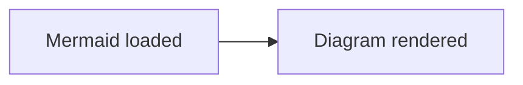

# Mermaid rendering test

When Mermaid is working, the following appears as two connected boxes—not as code.

```mermaid
flowchart LR
    A[Mermaid loaded] --> B[Diagram rendered]
```

<!-- Mermaid rendering: page-level fallback independent of the selected layout. -->

